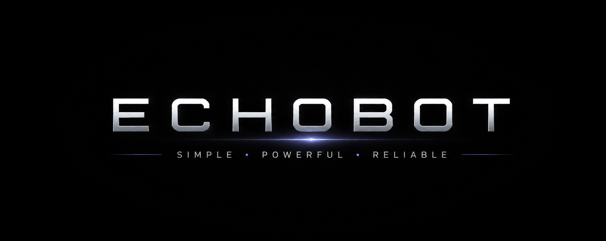

<p align="center">
  
</p>

<h1 align="center">EchoBOT</h1>

<p align="center">
  AI-Powered Discord Assistant with Conversational Intelligence, Music Streaming, Voice Recognition, Image Understanding, and Persistent Memory.
</p>

<p align="center">
  
  
  
  
  
</p>

---

## Overview

EchoBOT is a multifunctional Discord bot designed to bring AI-powered assistance and entertainment into Discord communities.

The project combines conversational AI, music playback, speech recognition, image analysis, and persistent memory systems into a single intelligent assistant capable of handling productivity, engagement, and automation tasks.

---

## Key Features

### 🤖 AI Assistant

Powered by Google Gemini AI.

* Intelligent conversations
* Coding assistance
* Technical explanations
* Learning support
* Context-aware responses

### 🎵 Music Streaming

Integrated music playback system for Discord voice channels.

* Play songs from search queries or URLs
* Queue management
* Pause, resume, and skip controls
* Voice channel integration

### 🎙️ Voice Recognition

Built using OpenAI Whisper.

* Speech-to-text processing
* Voice interaction workflows
* Audio command support

### 🖼️ Image Analysis

Upload images and receive AI-generated insights.

Supported scenarios:

* Code debugging
* Resume feedback
* UI/UX review
* Screenshot analysis
* Document interpretation

### 🧠 Persistent Memory Engine

Personalized user interactions through long-term memory storage.

* Store user preferences
* Recall saved information
* SQLite-backed persistence

### 🛠 Utility Services

* Weather information
* Server utilities
* Interactive games
* Leaderboard system
* Latency monitoring

---

## Technology Stack

| Category           | Technologies      |
| ------------------ | ----------------- |
| Language           | Python            |
| Framework          | Discord.py        |
| AI Models          | Google Gemini AI  |
| Speech Recognition | OpenAI Whisper    |
| Database           | SQLite            |
| Audio Processing   | FFmpeg            |
| Media Retrieval    | yt-dlp            |
| Networking         | aiohttp, requests |

---

## System Architecture

```text
Discord User
      │
      ▼
   EchoBOT
      │
 ┌────┼──────────────┐
 │    │              │
 ▼    ▼              ▼
AI  Music       Memory Engine
 │    │              │
 ▼    ▼              ▼
Gemini FFmpeg      SQLite

      │
      ▼
Voice & Image Processing
      │
 ├── Whisper
 └── Gemini Vision
```

---

## Installation

### Clone the Repository

```bash
git clone https://github.com/YOUR_USERNAME/echobot-ai-discord-bot.git
cd echobot-ai-discord-bot
```

### Install Dependencies

```bash
pip install -r requirements.txt
```

### Configure Environment Variables

Create a `.env` file in the project root:

```env
DISCORD_TOKEN=your_discord_token
GEMINI_API_KEY=your_gemini_api_key
WEATHER_API_KEY=your_weather_api_key
```

### Run the Bot

```bash
python bot.py
```

---

## Project Highlights

* Developed a multifunctional Discord assistant integrating AI, music streaming, speech recognition, image analysis, and persistent memory.
* Implemented conversational intelligence using Google Gemini AI.
* Built voice-processing workflows using OpenAI Whisper.
* Designed a persistent SQLite-based memory engine for personalized interactions.
* Integrated multiple external APIs within an asynchronous Discord.py architecture.
* Combined productivity, entertainment, and AI capabilities into a unified platform.

---

## Future Enhancements

* Modular command architecture using Discord Cogs
* Spotify integration
* AI-generated playlists
* Web dashboard for administration
* Advanced analytics and user insights
* Multi-server support enhancements

---

## Author

**Vansh Raj Tandon**

Computer Science Engineering Student

Focused on Artificial Intelligence, Backend Development, Automation, and Intelligent Systems.

---

⭐ If you find this project interesting, consider starring the repository.
